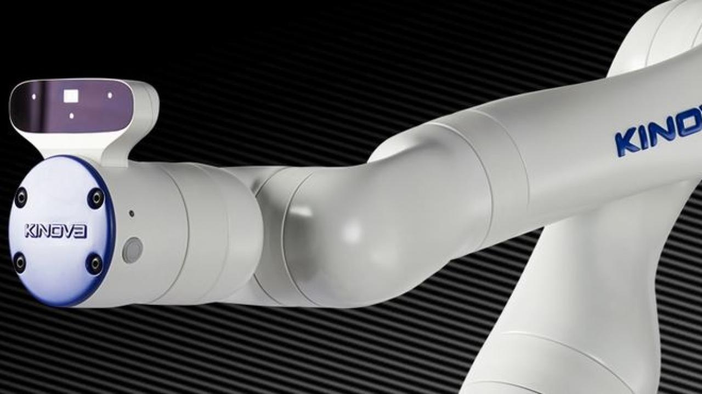
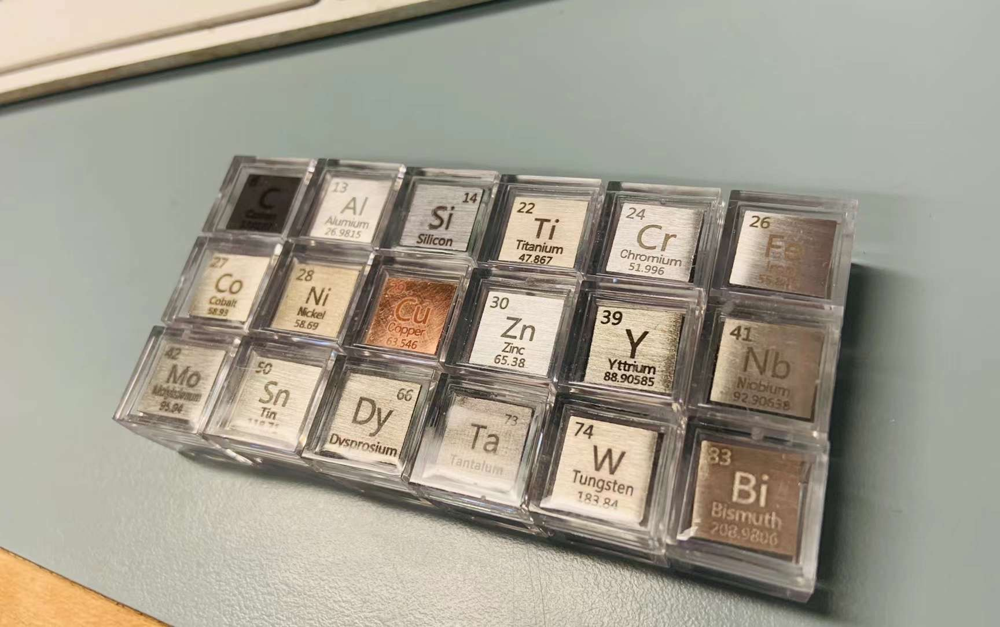

# Arm Balance


Authors:   
- Luke Yang  

A data science project that analyzes torque data for mass prediction. The copyright of this project belongs to [Hein Lab](http://groups2.chem.ubc.ca/jheints1).

## Description

This project is the supporting information for the paper `paper_name`.  

## Project proposal

We aim to investigate, analyze, and report using the torque data generated from 6-axis [Kinova Gen3 robotic arm](https://www.kinovarobotics.com/product/gen3-robots).



We aim to answer the following question: 
- **Can we predict the mass of an object that the arm holds by the torque measurements from its joints?** 

We plan to obtain the data by measuring objects with various weights. In particular, we chose element cubes as the objects for the arm to hold.

.

The masses of the cubes were recorded and saved in `data/raw_data` folder for further process
## Requirements

The requirements for package installation is encompassed in the `requirements.txt` for `pip` users and and `environment.yml` for Conda users.

To set up the environment in `pip`:  
```
pip install -r requirements.txt
```


## Dependencies
For the project to be correctly run, the following packages need to be installed. If the steps from the above could not be executed corrected, please make sure you have the following packages available in your environment by manual installation:

  - Python 3.10.8 and Python packages:
    - altair==4.2.0
    - numpy==1.23.5
    - pandas==1.4.4
    - scikit_learn==1.1.3


## Report

The machine learning analysis pipeline is located [here](report/main.pdf)

## Plots

The scripts that generated the plots in the paper are stored in `src/analysis`.
## Contributing

Contributions are what make the open-source community such an amazing place to learn, inspire, and create. Any contributions you make are greatly appreciated.

Please advise `CONTRIBUTING.md` for detailed information.
## License

Distributed under the MIT License. See `LICENSE.txt` for more information.


</div>

</div>
